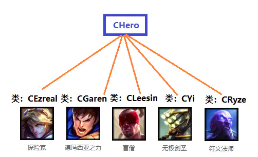

# 1. 构造函数为什么不能是虚函数
1. 构造一个对象的时候，必须知道对象的实际类型，而虚函数行为是在运行期间确定实际类型的。而在构造一个对象时，由于对象还未构造成功。编译器无法知道对象的实际类型，是该类本身，还是该类的一个派生类，或是更深层次的派生类。无法确定。
2. 虚函数的执行依赖于虚函数表。而虚函数表在构造函数中进行初始化工作，即初始化vptr，让他指向正确的虚函数表。而在构造对象期间，虚函数表还没有被初始化，将无法进行

# 2. 为什么要使用纯析构函数
使用虚析构函数的类一般是要作为基类，被其他类继承。通过把基类的析构函数声明为虚函数，就可以通过父类指针来释放子类对象，从而完成子类的一些清理工作，防止出现内存泄漏。
带有纯虚函数的类为抽象类，不能被实例化，只能被子类继承，所以当我们设计一个基类为抽象类时，可以把析构函数声明为纯虚析构函数，这样基类就是抽象类了。
注意：纯虚析构函数也要有函数体，用来做一些基类的清理工作，防止基类出现内存泄漏。

# 3. std::bind()函数详解
bind可以预先把某个可调用对象的某些参数绑定到已有的变量，产生一个新的可调用对象。bind本身是一种延迟计算的思想，可以用作回调函数，它本身可以绑定普通函数，全局函数，静态函数，类静态函数甚至是类成员函数。bind最终会产生一个可调用对象，这个对象可以直接赋值给std::function对象，而std::bind绑定的可调用对象可以是Lambda表达式或者类成员函数等可调用对象。
使用方法：
使用方式：bind（&要调用的函数，&对象， 要调用函数的参数1，要调用函数的参数2...，_1(bind函数的参数1)，_2(bind函数的参数2)...)
# 4. Std::function详解
类模版std::function是一种通用、多态的函数封装。std::function的实例可以对任何可以调用的目标实体进行存储、复制、和调用操作，这些目标实体包括普通函数、Lambda表达式、函数指针、以及其它函数对象等。std::function对象是对C++中现有的可调用实体的一种类型安全的包裹（我们知道像函数指针这类可调用实体，是类型不安全的）。
通常std::function是一个函数对象类，它包装其它任意的函数对象，被包装的函数对象具有类型为T1, …,TN的N个参数，并且返回一个可转换到R类型的值。std::function使用 模板转换构造函数接收被包装的函数对象；特别是，闭包类型可以隐式地转换为std::function。
# 5.C++多态有什么用？举例说明
1.不用记大量的函数名了，2.它会依据调用时的上下文来确定实现。在面向对象的程序设计中使用「多态」，能够增强程序的可扩充性，即程序需要修改或增加功能的时候，需要改动和增加的代码较少。
## LOL英雄联盟游戏例子
下面我们用设计 LOL 英雄联盟游戏的英雄的例子，说明多态为什么可以在修改或增加功能的时候，可以较少的改动代码。LOL 英雄联盟是 5v5 竞技游戏，游戏中有很多英雄，每种英雄都有一个「类」与之对应，每个英雄就是一个「对象」。英雄之间能够互相攻击，攻击敌人和被攻击时都有相应的动作，动作是通过对象的成员函数实现的。下面挑了五个英雄：

**探险家 CEzreal**  
**盖楼 CGaren**  
**盲僧 CLeesin**  
**无极剑圣 CYi**  
**瑞兹 CRyze**  

基本思路：
1. 为每个英雄类编写 Attack、FightBack 和 Hurted 成员函数。
Attack 函数表示攻击动作；  
FightBack 函数表示反击动作；  
Hurted 函数表示减少自身生命值，并表现受伤动作。  
2. 设置基类CHero，每个英雄类都继承此基类


## 01.非多态的实现方式

```
// 基类
class CHero 
{
protected:  
    int m_nPower ; //代表攻击力
    int m_nLifeValue ; //代表生命值
};
// 无极剑圣类
class CYi : public CHero 
{
public:
    // 攻击盖伦的攻击函数
    void Attack(CGaren * pGaren) 
    {
        .... // 表现攻击动作的代码
        pGaren->Hurted(m_nPower);
        pGaren->FightBack(this);
    }

    // 攻击瑞兹的攻击函数
    void Attack(CRyze * pRyze) 
    {
        .... // 表现攻击动作的代码
        pRyze->Hurted(m_nPower);
        pRyze->FightBack( this);
    }
    // 减少自身生命值
    void Hurted(int nPower) 
    {
        ... // 表现受伤动作的代码
        m_nLifeValue -= nPower;
    }
    
    // 反击盖伦的反击函数
    void FightBack(CGaren * pGaren) 
    {
        ...．// 表现反击动作的代码
        pGaren->Hurted(m_nPower/2);
    }
    
    // 反击瑞兹的反击函数
    void FightBack(CRyze * pRyze) 
    {
        ...．// 表现反击动作的代码
        pRyze->Hurted(m_nPower/2);
    }
};
```

有 n 种英雄，CYi 类中就会有 n 个 Attack 成员函数，以及 n 个 FightBack 成员函数。对于其他类也如此。
如果游戏版本升级，增加了新的英雄寒冰艾希 CAshe，则程序改动较大。所有的类都需要增加两个成员函数:

```
void Attack(CAshe * pAshe);
void FightBack(CAshe * pAshe);
```

这样工作量是非常大的！！非常的不人性，所以这种设计方式是非常的不好！
## 02.多态的实现方式

```
// 基类
class CHero 
{
public:
    virtual void Attack(CHero *pHero){}
    virtual voidFightBack(CHero *pHero){}
    virtual void Hurted(int nPower){}

protected:  
    int m_nPower ; //代表攻击力
    int m_nLifeValue ; //代表生命值
};
// 派生类 CYi:
class CYi : public CHero {
public:
    // 攻击函数
    void Attack(CHero * pHero) 
    {
        .... // 表现攻击动作的代码
        pHero->Hurted(m_nPower); // 多态
        pHero->FightBack(this);  // 多态
    }
    
    // 减少自身生命值
    void Hurted(int nPower) 
    {
        ... // 表现受伤动作的代码
        m_nLifeValue -= nPower;
    }
    
    // 反击函数
    void FightBack(CHero * pHero) 
    {
        ...．// 表现反击动作的代码
        pHero->Hurted(m_nPower/2); // 多态
    }
};
```

如果增加了新的英雄寒冰艾希 CAshe，只需要编写新类CAshe，不再需要在已有的类里专门为新英雄增加：

```
void Attack( CAshe * pAshe) ;
void FightBack(CAshe * pAshe) ;
```

所以已有的类可以原封不动，那么使用多态的特性新增英雄的时候，可见改动量是非常少的。
多态使用方式

```
void CYi::Attack(CHero * pHero) 
{
    pHero->Hurted(m_nPower); // 多态
    pHero->FightBack(this);  // 多态
}

CYi yi; 
CGaren garen; 
CLeesin leesin; 
CEzreal ezreal;
yi.Attack( &garen );  //(1)
yi.Attack( &leesin ); //(2)
yi.Attack( &ezreal ); //(3)
```

根据多态的规则，上面的(1)，(2)，(3)进入到 CYi::Attack 函数后 ，分别调用

```
CGaren::Hurted
CLeesin::Hurted
CEzreal::Hurted
```
